<div align="center" style="font-size:40px" >Sprint 1 Big Data Analytics</div>

<div align="center" style="font-size:20px" >By: Eric Hyun</div>

# Project Objectives

### The project has the following objectives. 

1. Determine if teams are more successful with high offenses, tight defenses or a balance of the two.
2. Determine if this conclusion is valid across multiple time periods.

- Period 1 - before 1920
- Period 2 - 1920 to 1960
- Period 3 - 1960 to 1990
- Period 4 - 1990 to 2010

# Sprint 1 - Table of Content 

### Section 1
1. Perform an exploratory data analysis to understand the statistical properties and distribution shapes of 8 key variables of your choice. Perform this analysis for a single dataset that spans 1960 to 2010.

- Calculate the descriptive statistics for the 8 variables
- Show a histogram for each of the 8 variables
- Show a boxplot for each of the 8 variables
- Comment on the visual shape of the distribution of each variable
 - Is it symmetric?
 - Is there a single mode?
 - Is it narrow or wide?
 - Are there many outliers?
 - Comment on the validity of the assumption that each of the 8 variables is normally distributed.

### Section 2 
2. Do a correlation analysis for the following pairs of fields for the complete data spanning 1960 to 2010.
- Games Won vs Runs Scored
- Games Won vs Runs Against
- Games Won vs (Runs Scored minus Runs Against)
- Games Lost vs Runs Scored
- Games Lost vs Runs Against
- Games Lost vs (Runs Scored minus Runs Against
- Provide an interpretation and commentary for your analysis.

# Data Preparation


```python
# Importing Libraries to use in this project (panda for dataframe, matplotlib & seaborn for visualization)
import pandas as pd
import matplotlib.pyplot as plt
import seaborn as sns 
```


```python
# To read csv file saved in my computer
df = pd.read_csv(r'C:\Users\tmddl\OneDrive\Desktop\York U - Big Data\Group Project\baseball_teams.csv')
```


```python
# To remove any spaces/string in column names
df.columns = df.columns.str.strip()
```


```python
# To view full rows in tables
# pd.set_option('display.max_rows', None)
# pd.set_option('display.max_columns', None)
```

<div style="font-size:30px; font-weight:bold; border:1.5px solid black; padding: 5px">Section 1</div>


```python
# To filter the data from year 1960-2010 with chosen variables
df_filtered = df[(df['Year'] >= 1960) & (df['Year'] <= 2010)][['Year','Games_Won','Games_Lost','Strike_Outs','Home_Runs','Runs_Scored','Hits_Allowed', 'Home_Run_Allowed', 'Saves']]
```


```python
# To Change Rows/Columns 
stats = df_filtered.describe().T
```


```python
# To include median into the decriptive table, and display the table
stats['median'] = df.median(numeric_only=True)
print(stats)
```

                       count         mean         std     min      25%     50%  \
    Year              1312.0  1986.958841   14.413946  1960.0  1975.00  1988.0   
    Games_Won         1312.0    79.523628   12.516572    37.0    71.00    80.0   
    Games_Lost        1312.0    79.523628   12.464481    40.0    71.00    79.0   
    Strike_Outs       1312.0   932.101372  152.857630   379.0   838.75   927.0   
    Home_Runs         1312.0   142.350610   40.518801    32.0   113.00   139.0   
    Runs_Scored       1312.0   703.445884  102.107114   329.0   641.00   704.0   
    Hits_Allowed      1312.0  1408.827744  128.065442   827.0  1350.00  1421.5   
    Home_Run_Allowed  1312.0   142.350610   34.559522    40.0   118.00   141.0   
    Saves             1312.0    36.162348    9.363350    10.0    30.00    36.0   
    
                          75%     max  median    mode  
    Year              2000.00  2010.0  1963.0  1884.0  
    Games_Won           89.00   116.0    77.0    83.0  
    Games_Lost          88.00   120.0    76.0    76.0  
    Strike_Outs       1037.25  1529.0   757.0     0.0  
    Home_Runs          169.00   264.0   107.0    20.0  
    Runs_Scored        771.00  1009.0   690.0   682.0  
    Hits_Allowed      1488.25  1734.0  1392.0  1406.0  
    Home_Run_Allowed   166.00   241.0   109.0    16.0  
    Saves               43.00    68.0    24.0     0.0  
    


```python
# Defining the max value in the variable and setting the bins parameters 
max_point = df_filtered['Games_Won'].max()
bins = range(30, int(max_point)+10, 10) 

# Plotting the histogram 
plt.hist(df_filtered['Games_Won'], bins=15, edgecolor='black') 

# Labels for the graph 
plt.title('Games Won 1960-2010')
plt.xlabel('Games Won')
plt.ylabel('Frequency')
plt.xticks(bins)

# Display  the graph
plt.show()
```


    
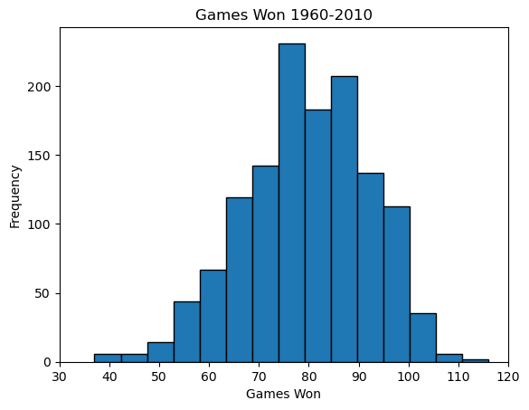
    


```python
# Defining the max value in the variable and setting the bins parameters 
max_point = df_filtered['Games_Lost'].max()
bins = range(30, int(max_point)+10, 10) 

# Plotting the histogram 
plt.hist(df_filtered['Games_Lost'], bins=15, edgecolor='black') 

# Labels for the graph 
plt.title('Games Lost 1960-2010')
plt.xlabel('Games Lost')
plt.ylabel('Frequency')
plt.xticks(bins)

# Display  the graph
plt.show()
```


    
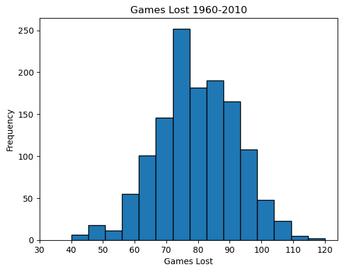
    


```python
# Defining the max value in the variable and setting the bins parameters 
max_point = df_filtered['Strike_Outs'].max()
bins = range(300, int(max_point)+50, 100) 

# Plotting the histogram 
plt.hist(df_filtered['Strike_Outs'], bins=25, edgecolor='black') 

# Labels for the graph 
plt.title('Strike Outs 1960-2010')
plt.xlabel('Strike Outs')
plt.ylabel('Frequency')
plt.xticks(bins)

# Display  the graph
plt.show()
```


    
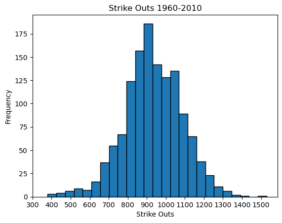
    


```python
# Defining the max value in the variable and setting the bins parameters 
max_point = df_filtered['Home_Runs'].max()
bins = range(20, int(max_point)+10, 20) 

# Plotting the histogram 
plt.hist(df_filtered['Home_Runs'], bins=15, edgecolor='black') 

# Labels for the graph 
plt.title('Home_Runs 1960-2010')
plt.xlabel('Home Runs')
plt.ylabel('Frequency')
plt.xticks(bins)

# Display  the graph
plt.show()
```


    
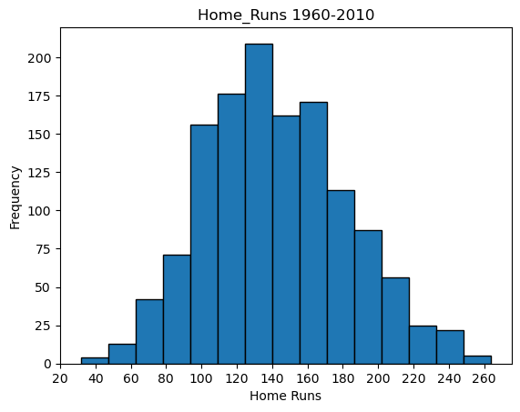
    


```python
# Defining the max value in the variable and setting the bins parameters 
max_point = df_filtered['Runs_Scored'].max()
bins = range(300, int(max_point)+50, 100) 

# Plotting the histogram 
plt.hist(df_filtered['Runs_Scored'], bins=20, edgecolor='black') 

# Labels for the graph 
plt.title('Runs_Scored 1960-2010')
plt.xlabel('Runs Scored')
plt.ylabel('Frequency')
plt.xticks(bins)

# Display  the graph
plt.show()
```


    
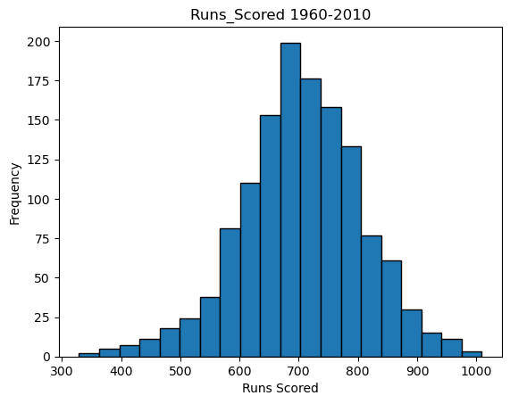
    


```python
# Defining the max value in the variable and setting the bins parameters 
max_point = df_filtered['Hits_Allowed'].max()
bins = range(800, int(max_point)+50, 100) 

# Plotting the histogram 
plt.hist(df_filtered['Hits_Allowed'], bins=20, edgecolor='black') 

# Labels for the graph 
plt.title('Hits Allowed 1960-2010')
plt.xlabel('Hits Allowed')
plt.ylabel('Frequency')
plt.xticks(bins)

# Display  the graph
plt.show()
```


    
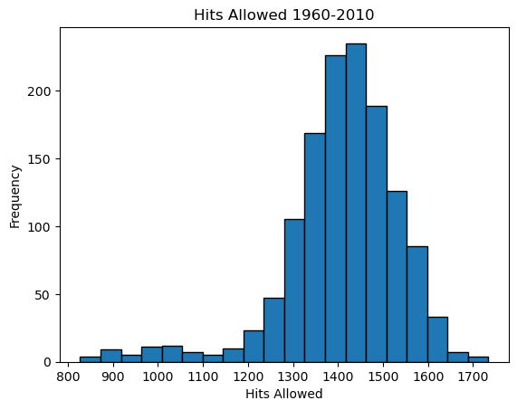
    


```python
# Defining the max value in the variable and setting the bins parameters 
max_point = df_filtered['Home_Run_Allowed'].max()
bins = range(30, int(max_point)+10, 20) 

# Plotting the histogram 
plt.hist(df_filtered['Home_Run_Allowed'], bins=15, edgecolor='black') 

# Labels for the graph 
plt.title('Home Runs Allowed 1960-2010')
plt.xlabel('Home Runs Allowed')
plt.ylabel('Frequency')
plt.xticks(bins)

# Display  the graph
plt.show()
```


    
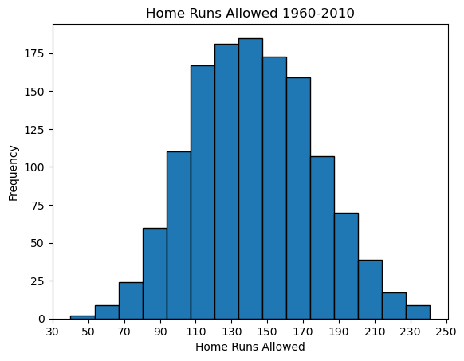
    


```python
# Defining the max value in the variable and setting the bins parameters 
max_point = df_filtered['Saves'].max()
bins = range(5, int(max_point)+5, 5) 

# Plotting the histogram 
plt.hist(df_filtered['Saves'], bins=15, edgecolor='black') 

# Labels for the graph 
plt.title('Saves 1960-2010')
plt.xlabel('Saves')
plt.ylabel('Frequency')
plt.xticks(bins)

# Display  the graph
plt.show()
```


    
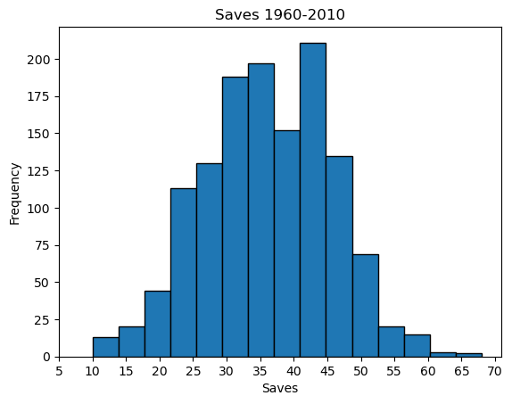
    


```python
# To plot multiple plots in one figure
fig, ax = plt.subplots(2, 2)

# To set height & width for the plots
fig.set_figheight(15)
fig.set_figwidth(30)

# Adding Spacing between boxes
fig.tight_layout(h_pad=5, w_pad=3)

# Plotting the boxplot with title
sns.boxplot(x=df['Games_Won'], ax=ax[0, 0], linewidth = 5)
ax[0,0].set_title('Games Won 1960-2010', fontsize=20, fontweight='bold')

sns.boxplot(x=df['Games_Lost'], ax=ax[0, 1], linewidth = 5)
ax[0,1].set_title('Games Lost 1960-2010', fontsize=20, fontweight='bold')

sns.boxplot(x=df['Strike_Outs'], ax=ax[1, 0], linewidth = 5)
ax[1,0].set_title('Strike Outs 1960-2010', fontsize=20, fontweight='bold')

sns.boxplot(x=df['Home_Runs'], ax=ax[1, 1], linewidth = 5)
ax[1,1].set_title('Home Runs 1960-2010', fontsize=20, fontweight='bold')
```


    Text(0.5, 1.0, 'Home Runs 1960-2010')


    
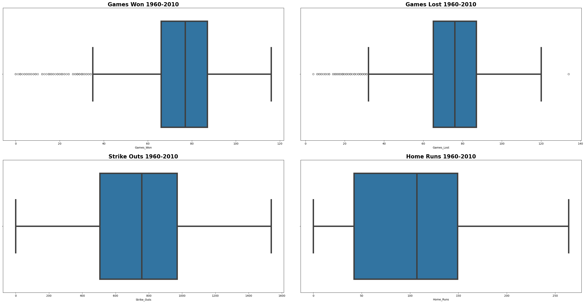
    


```python
# To plot multiple plots in one figure
fig, ax = plt.subplots(2, 2)

# To set height & width for the plots
fig.set_figheight(15)
fig.set_figwidth(30)

# Adding Spacing between boxes
fig.tight_layout(h_pad=5, w_pad=3)

# Plotting the boxplot with title
sns.boxplot(x=df['Runs_Scored'], ax=ax[0, 0], linewidth = 5)
ax[0,0].set_title('Runs Scored 1960-2010', fontsize=20, fontweight='bold')

sns.boxplot(x=df['Hits_Allowed'], ax=ax[0, 1], linewidth = 5)
ax[0,1].set_title('Hits Allowed 1960-2010', fontsize=20, fontweight='bold')

sns.boxplot(x=df['Home_Run_Allowed'], ax=ax[1, 0], linewidth = 5)
ax[1,0].set_title('Home Run Allowed 1960-2010', fontsize=20, fontweight='bold')

sns.boxplot(x=df['Saves'], ax=ax[1, 1], linewidth = 5)
ax[1,1].set_title('Saves 1960-2010', fontsize=20, fontweight='bold')


```


    Text(0.5, 1.0, 'Saves 1960-2010')


    
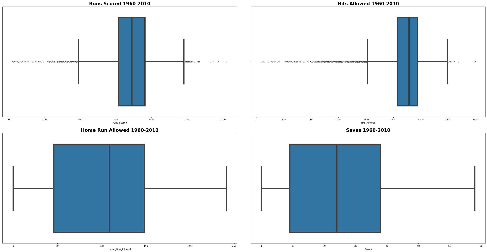
    


## Commentary on Visual Shape & Distribution

### Based on visual shape of the distribution of each variable, we can see that for...

#### Games Won
- The distribution is slightly skewed to the left.
- There are few peaks of histogram indicating a possible multi-modes.
- The distribution is moderately narrow closer to the median/centre of distribution. (supported by small standard deviation)
- There are significant amount of outliers based on the boxplot meaning (1.5x the interquartile).

#### Games Lost
- The distribution is slightly skewed to the left.
- There is a clear peak of histogram indicating a one mode likely.
- The distribution is moderately narrow closer to the median/centre of distribution.(supported by small standard deviation)
- There are significant amount of outliers based on the boxplot meaning (1.5x the interquartile).

#### Strike Outs
- The distribution is relatively symmetrical based on the visual shape.
- There is a clear peak of histogram indicating a one mode likely.
- The distribution is moderately narrow closer to the median/centre of distribution. (supported by small standard deviation)
- There are no significant evidence of outliers based on the boxplot visuals. 

#### Home Runs
- The distribution is slightly skewed to the right but still looks symmetrical based on the visual shape of the graph.
- There are few peaks of histogram indicating a possible multi-modes.
- The distribution is moderately narrow closer to the median/centre of distribution.
- There are no significant evidence of outliers based on the boxplot visuals. 

#### Runs Scored
- The distribution is slightly skewed to the left.
- There is a clear peak of histogram indicating a one mode likely.
- The distribution is moderately narrow closer to the median/centre of distribution.
- There are significant amount of outliers based on the boxplot meaning (1.5x the interquartile) 

#### Hits Allowed
- The distribution is significantly skewed to the left.
- There are few peaks of histogram indicating a possible multi-modes.
- The distribution is moderately narrow closer to the median/centre of distribution.
- There are significant amount of outliers based on the boxplot meaning (1.5x the interquartile) 

#### Home Runs Allowed
- The distribution is relatively symmetrical based on the visual shape.
- There are few peaks of histogram indicating a possible multi-modes.
- The distribution is moderately narrow closer to the median/centre of distribution.
- There are no significant evidence of outliers based on the boxplot visuals. 

#### Saves
- The distribution is relatively symmetrical but with a degree of skewness to the left.
- There are few peaks of histogram indicating a possible multi-modes.
- The distribution is moderately narrow closer to the median/centre of distribution.
- There are no significant evidence of outliers based on the boxplot visuals. 


### Commentary on the validity of the assumption that each variables above are normally distributed

#### To determine the validity of this assumption, we have to assess whether the data points for each variable are symmetrical around the mean, whether the data points are mainly scattered around the center, and finally if (mean, mode, median) are equal to each other by definition.

#### Although not perfect, based on our previous analysis of the visual observation of the histogram and boxplot that we have created for each variable selected, we can see that variables such as strike out, home runs, and home runs allowed have a close to symmetrical distribution of the histogram that has data points that are primarily scattered in the center of the distribution and that most likely will result in close to or equal to mean/median/mode range of values. Based on those factors, we can agree that for those specific variables mentioned, the assumptions hold true. 

<div style="font-size:30px; font-weight:bold; border:1.5px solid black; padding: 5px">Section 2</div>


```python
# To filter the data from 1960 to 2010 for variable Games Won & Runs Scored 
GWRS_df = df[(df['Year'] >= 1960) & (df['Year'] <= 2010)][['Year','Games_Won','Runs_Scored']]
```


```python
# To calculate the correlation coefficient between Games Won vs. Runs Scored
correlation_1 = GWRS_df['Games_Won'].corr(GWRS_df['Runs_Scored'])
print('The correlation between Games Won and Runs Scored:', correlation_1)
```

    The correlation between Games Won and Runs Scored: 0.5958277670854698
    


```python
# To plot a scatterplot with linear regression to display correlation coefficient between the variables
sns.lmplot(data=GWRS_df, x='Runs_Scored', y='Games_Won', height=4, aspect=1.4)

# To label the graph 
plt.title('Games Won vs Runs Scored (1960–2010)')
plt.xlabel("Runs Scored", size = 12)
plt.ylabel("Games Won", size = 12)

# To display grids in the graph 
plt.grid(True)

# To display the graph 
plt.show()
```


    
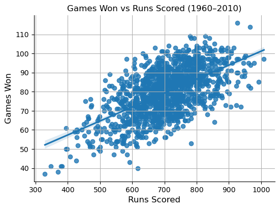
    


```python
# To filter the data from 1960 to 2010 for variable Games Won & Runs Against
GWRA_df = df[(df['Year'] >= 1960) & (df['Year'] <= 2010)][['Year','Games_Won','Runs_Against']]
```


```python
# To calculate the correlation coefficient between Games Won vs. Runs Scored
correlation_2 = GWRA_df['Games_Won'].corr(GWRA_df['Runs_Against'])
print('The correlation between Games Won and Runs Against:', correlation_2)
```

    The correlation between Games Won and Runs Against: -0.24815754285361907
    


```python
# To plot a scatterplot with linear regression to display correlation coefficient between the variables
sns.lmplot(data=GWRA_df, x='Runs_Against', y='Games_Won', height=4, aspect=1.4)

# To label the graph 
plt.title('Games Won vs Runs Against (1960–2010)')
plt.xlabel("Runs Against", size = 12)
plt.ylabel("Games Won", size = 12)

# To display grids in the graph 
plt.grid(True)

# To display the graph 
plt.show()
```


    
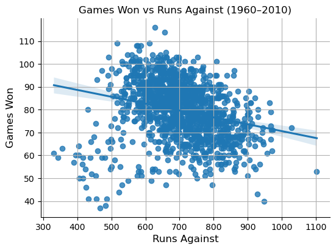
    


```python
# To Calculate the difference between Runs scored & Runs Against
df['Runs_Total'] = df['Runs_Scored'] - df['Runs_Against']
# print(df['Runs_Total'])
```


```python
# To filter the data from 1960 to 2010 for variable Games Won & Runs Total(Runs Scored - Runs Against)  
GWTA_df = df[(df['Year'] >= 1960) & (df['Year'] <= 2010)][['Year','Games_Won','Runs_Total']]
```


```python
# To calculate the correlation coefficient between Games Won vs. Runs Scored
correlation_3 = GWTA_df['Games_Won'].corr(GWTA_df['Runs_Total'])
print('The correlation between Games Won and Runs Total:', correlation_3)
```

    The correlation between Games Won and Runs Total: 0.8504113793468357
    


```python
# To plot a scatterplot with linear regression to display correlation coefficient between the variables
sns.lmplot(data=GWTA_df, x='Runs_Total', y='Games_Won', height=4, aspect=1.4)

# To label the graph 
plt.title('Games Won vs Runs Total (1960–2010)')
plt.xlabel("Runs Total", size = 12)
plt.ylabel("Games Won", size = 12)

# To display grids in the graph 
plt.grid(True)

# To display the graph 
plt.show()
```


    
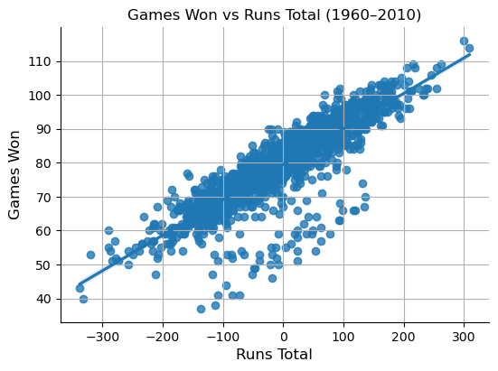
    


```python
# To filter the data from 1960 to 2010 for variable Games Lost & Runs Scored 
GLRS_df = df[(df['Year'] >= 1960) & (df['Year'] <= 2010)][['Year','Games_Lost','Runs_Scored']]
```


```python
# To calculate the correlation coefficient between Games Lost vs. Runs Scored
correlation_4 = GLRS_df['Games_Lost'].corr(GLRS_df['Runs_Scored'])
print('The correlation between Games Lost and Runs Scored:', correlation_4)
```

    The correlation between Games Lost and Runs Scored: -0.22677225074354806
    


```python
# To plot a scatterplot with linear regression to display correlation coefficient between the variables
sns.lmplot(data=GLRS_df, x='Runs_Scored', y='Games_Lost', height=4, aspect=1.4)

# To label the graph 
plt.title('Games Lost vs Runs Scored (1960–2010)')
plt.xlabel("Runs Scored", size = 12)
plt.ylabel("Games Lost", size = 12)

# To display grids in the graph 
plt.grid(True)

# To display the graph 
plt.show()
```


    
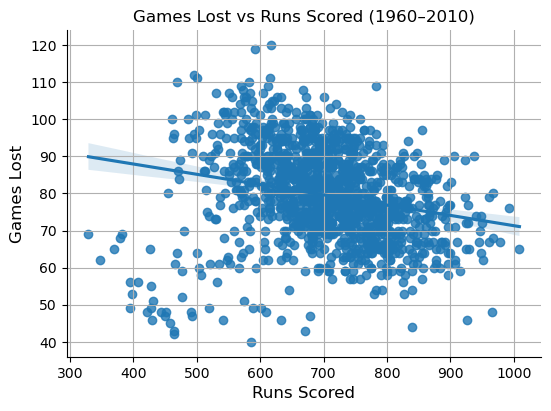
    


```python
# To filter the data from 1960 to 2010 for variable Games Lost & Runs Against
GLRA_df = df[(df['Year'] >= 1960) & (df['Year'] <= 2010)][['Year','Games_Lost','Runs_Against']]
```


```python
# To calculate the correlation coefficient between Games Lost vs. Runs Against
correlation_5 = GLRA_df['Games_Lost'].corr(GLRA_df['Runs_Against'])
print('The correlation between Games Lost and Runs Against:', correlation_5)
```

    The correlation between Games Lost and Runs Against: 0.6111768041759513
    


```python
# To plot a scatterplot with linear regression to display correlation coefficient between the variables
sns.lmplot(data=GLRA_df, x='Runs_Against', y='Games_Lost', height=4, aspect=1.4)

# To label the graph 
plt.title('Games Lost vs Runs Against (1960–2010)')
plt.xlabel("Runs Against", size = 12)
plt.ylabel("Games Lost", size = 12)

# To display grids in the graph 
plt.grid(True)

# To display the graph 
plt.show()
```


    
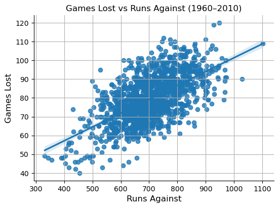
    


```python
# To filter the data from 1960 to 2010 for variable Games Lost & Runs Total 
GLTA_df = df[(df['Year'] >= 1960) & (df['Year'] <= 2010)][['Year','Games_Lost','Runs_Total']]
```


```python
# To plot a scatterplot with linear regression to display correlation coefficient between the variables
correlation_6 = GLTA_df['Games_Lost'].corr(GLTA_df['Runs_Total'])
print('The correlation between Games Lost and Runs Total:', correlation_6)
```

    The correlation between Games Lost and Runs Total: -0.8493581790868784
    


```python
# To plot a scatterplot with linear regression to display correlation coefficient between the variables
sns.lmplot(data=GLTA_df, x='Runs_Total', y='Games_Lost', height=4, aspect=1.4)

# To label the graph 
plt.title('Games Lost vs Runs Total (1960–2010)')
plt.xlabel("Runs Total", size = 12)
plt.ylabel("Games Lost", size = 12)

# To display grids in the graph 
plt.grid(True)

# To display the graph 
plt.show()

```


    
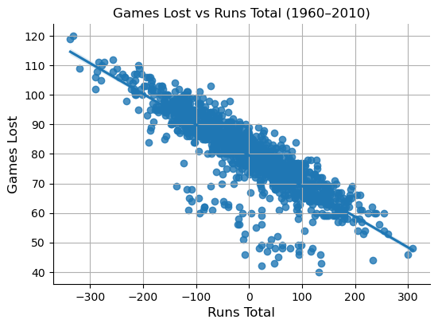
    


# Interpretation & Analysis 

## When analyzing Correlation coefficient of a variable, we know that...
-  Correlation coefficient between 0 to 0.3 (-0.3 to 0) is considered <b><u>Weak</u></b> 
-  Correlation coefficient between 0.3 to 0.7 (-0.7 to -0.3) is considered <b><u>Moderate</u></b> 
- Correlation coefficient between 0.7 to 1 (-1 to -0.7) is considered <b><u>Strong</u></b>

#### Based on the matrix above, we can analyze and see that correlation coefficient between...

- Games Won vs. Runs Scored = 0.59 (Moderate Positive Correlation), meaning that as # of Games Won increase so does the Runs scored by a moderate level. 

- Games Won vs. Runs Against = -0.24 (Weak Negative Correlation), meaning that as # of Games Won increase, Runs against decrease by a weak level. 

- Games Won vs. Runs Total (Runs Scored - Runs Against) = 0.85 (Strong Positive Correlation), meaning that as # of Games Won increase, so does the Runs Total. 

- Games Lost vs. Runs Scored = -0.22 (Weak Negative Correlation), meaning that as # of Games Lost increase, Runs scored decrease by a weak level.

- Games Lost vs. Runs Against = 0.61 (Moderate Positive Correlation), meaning that as # of Games Lost increase, so does the Runs Against by a moderate level. 

- Games Lost vs. Runs Total (Runs Scored - Runs Against) = -0.84, meaning that as of # of Games Lost increase, Runs Total decrease by a strong level. 

- Based on Visual observation of the scatterplots, We can also see that with stronger correlation coefficient, the dispersion of data points are clustered around the linear regression line where as moderate to weak correlation coefficient result in more data points that are scattered out and further away from the linear regression line (indicating weaker relationship between the two variables). 
